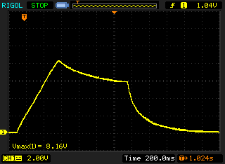
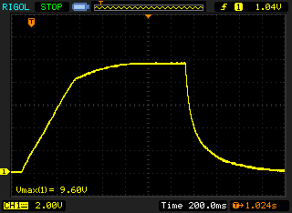
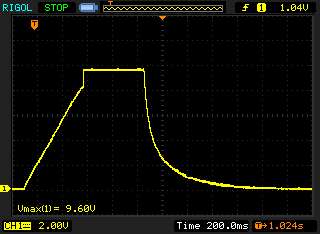
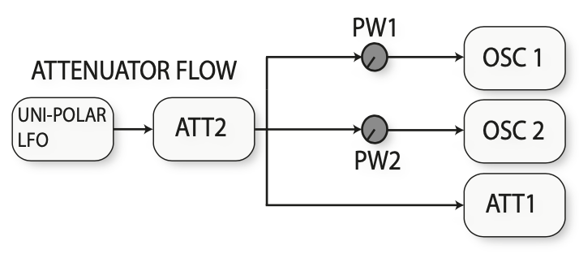
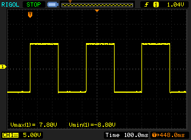
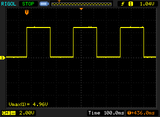
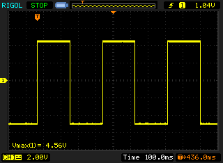

= Behringer Neutron

This page contains some oscilloscope views on the Behringer Neutron and interesting findings.

== Envelope levels

The envelope peak of the attack level is lower than the maximum sustain level. I would have expected that the peak of the attack would be equal to the maximum sustain level, and thus that it would make no difference where you set the decay when the sustain is at max. But this is not the case, as the following oscilloscope outputs show.

In the following image, the sustain is at about in the middle. The peak of the attack goes to +8.2V. 

Here the sustain as at the full level, which goes to 9.6V. The decay is kept at the same level as in the previous picture. Notice that the decay is now an raise instead of decay.

Turning down the decay to minimum, there is an immidate raise from +8.2V to +9.6V.

In other words, it always makes a difference at what level you have the decay, except if the sustain is set to about +8.2V.

According to the manual, the envelope outputs max +9V.

Both envelope 1 and 2 behave identically.

== Attenuator 1 output

According to the manual, this is the default attenuator flow:

Since the unipolar output is according to the manual 0V to +5V, one would expect that the output of ATT1 would be 0V to +5V if both the Attenuator 1 and 2 knobs are turned to max. It turns out, that the output at ATT1 is instead a bipolar signal in the range -8.8V to +7.8V.

I assume this is a bug in the manual, and that the diagram should say bipolar LFO instead. This does not however explain the wide voltage range, which I would then have expected to be -5V to +5V.

== LFO outputs

Teh unipolar output looks as expected, and goes between 0V and +5V.

Unfortunately the following image does not contain the minimum value, but it can be seen that the output is biased towards the negative side, like with the bipolar output of the default ATT1 routing.

